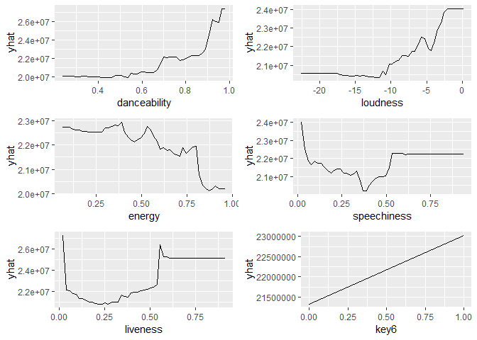
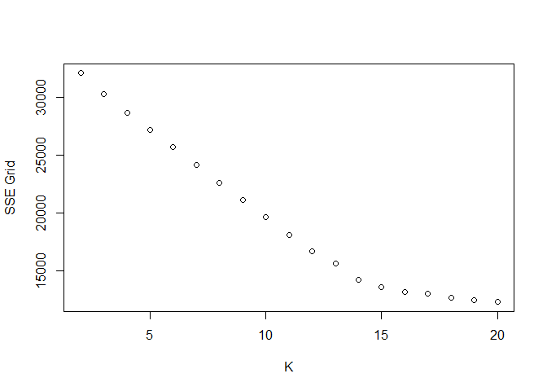
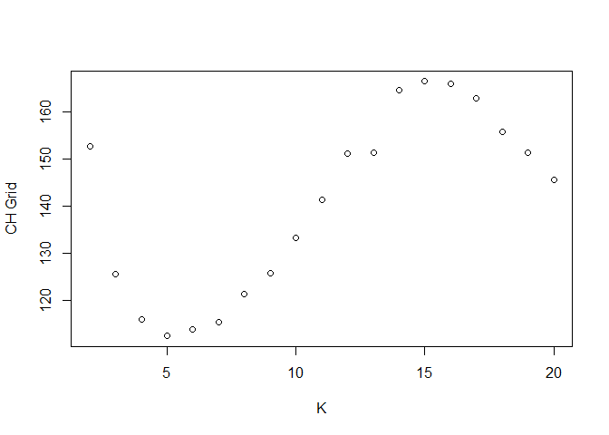
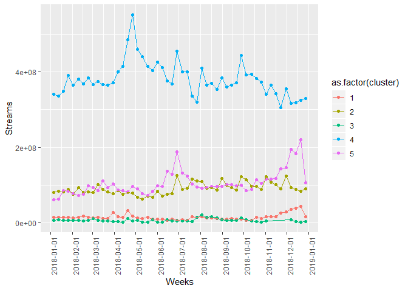

The Streams Analysis of Pop Music in 2018
=========================================

By Chong Wang, Tianping Wu, Zhenning Zhao, Zhiyang Lin

Abstract
--------

In this project, we gathered data from Spotify.com, and built linear and non-linear prediction models of the total streams of the songs, and improved the performance of the prediction comparing with the baseline model. We also segmented the songs into 5 groups through unsupervised algorithm, and assessed the popularity trend for different groups throughout the entire year. The result of this project can help digital music servers improve playlist song recommendations, and help record companies make album promotion decisions.

Introduction
------------

Popular music market is remarkably large, especially in recent years. Songs inspire generations from all walks of life. Every day, oceans of tracks jump on to the Top 200 List on Spotify. In this project, we analyzed the data of the 2018 popular music database from Spotify.com, with the aim of helping digital music servers to improve playlist song recommendations, and helping record companies to make album promotion decisions according to the predictions on the playing streams.

This project mainly answered the following questions: first, predict the streams of the tracks; and second, analysis of the pattern of the popularity trend. As for the first question, we used stepwise method, the lasso method and the random forest and boosting to build a prediction model of track streams, having features of the songs and the albums as predictors. As for the second question, we firstly used PCA and K-means to cluster the songs by features, dividing songs into different categories; then we plotted the trend of the popularity of different types of songs, showing the changes in the trend of listeners' tastes.

Data
----

Spotify is one of the biggest digital music servicers that includes a variety of songs. From <https://spotifycharts.com>, we downloaded the weekly data of the top 200 songs in the US. The data in year 2018 gives us access to 1,497 different songs.

Thanks to Spotify's public API, we also had access to the data on the song features. We used python robot to gather the data of song features, artists and album information. In the end, the formal dataset includes the following variables:

<b>Table1: Variable Descriptions</b>

<table style="width:56%;">
<colgroup>
<col width="23%" />
<col width="31%" />
</colgroup>
<thead>
<tr class="header">
<th>variables</th>
<th>descriptions</th>
</tr>
</thead>
<tbody>
<tr class="odd">
<td>id</td>
<td>song ID</td>
</tr>
<tr class="even">
<td>duration_ms_x</td>
<td>The duration of the track in milliseconds.</td>
</tr>
<tr class="odd">
<td>acousticness</td>
<td>A confidence measure from 0.0 to 1.0 of whether the track is acoustic. 1.0 represents high confidence the track is acoustic.</td>
</tr>
<tr class="even">
<td>danceability</td>
<td>Danceability describes how suitable a track is for dancing based on a combination of musical elements including tempo, rhythm stability, beat strength, and overall regularity. A value of 0.0 is least danceable and 1.0 is most danceable.</td>
</tr>
<tr class="odd">
<td>energy</td>
<td>Energy is a measure from 0.0 to 1.0 and represents a perceptual measure of intensity and activity. Typically, energetic tracks feel fast, loud, and noisy. For example, death metal has high energy, while a Bach prelude scores low on the scale. Perceptual features contributing to this attribute include dynamic range, perceived loudness, timbre, onset rate, and general entropy.</td>
</tr>
<tr class="even">
<td>instrumentalness</td>
<td>Predicts whether a track contains no vocals. “Ooh??? and “aah??? sounds are treated as instrumental in this context. Rap or spoken word tracks are clearly “vocal???. The closer the instrumentalness value is to 1.0, the greater likelihood the track contains no vocal content. Values above 0.5 are intended to represent instrumental tracks, but confidence is higher as the value approaches 1.0.</td>
</tr>
<tr class="odd">
<td>liveness</td>
<td>Detects the presence of an audience in the recording. Higher liveness values represent an increased probability that the track was performed live. A value above 0.8 provides strong likelihood that the track is live.</td>
</tr>
<tr class="even">
<td>loudness</td>
<td>The overall loudness of a track in decibels (dB). Loudness values are averaged across the entire track and are useful for comparing relative loudness of tracks. Loudness is the quality of a sound that is the primary psychological correlate of physical strength (amplitude). Values typical range between -60 and 0 db.</td>
</tr>
<tr class="odd">
<td>mode</td>
<td>Mode indicates the modality (major or minor) of a track, the type of scale from which its melodic content is derived. Major is represented by 1 and minor is 0.</td>
</tr>
<tr class="even">
<td>speechiness</td>
<td>Speechiness detects the presence of spoken words in a track. The more exclusively speech-like the recording (e.g. talk show, audio book, poetry), the closer to 1.0 the attribute value. Values above 0.66 describe tracks that are probably made entirely of spoken words. Values between 0.33 and 0.66 describe tracks that may contain both music and speech, either in sections or layered, including such cases as rap music. Values below 0.33 most likely represent music and other non-speech-like tracks.</td>
</tr>
<tr class="odd">
<td>tempo</td>
<td>The overall estimated tempo of a track in beats per minute (BPM). In musical terminology, tempo is the speed or pace of a given piece and derives directly from the average beat duration.</td>
</tr>
<tr class="even">
<td>valence</td>
<td>A measure from 0.0 to 1.0 describing the musical positiveness conveyed by a track. Tracks with high valence sound more positive (e.g. happy, cheerful, euphoric), while tracks with low valence sound more negative (e.g. sad, depressed, angry).</td>
</tr>
<tr class="odd">
<td>key</td>
<td>The estimated overall key of the track. Integers map to pitches using standard Pitch Class notation . E.g. 0 = C, 1 = C???/D???, 2 = D, and so on. If no key was detected, the value is -1.</td>
</tr>
<tr class="even">
<td>time_signature</td>
<td>An estimated overall time signature of a track. The time signature (meter) is a notational convention to specify how many beats are in each bar (or measure).</td>
</tr>
<tr class="odd">
<td>relseaseDuration</td>
<td>The duration since the date the album was first released till the end of 2018.</td>
</tr>
</tbody>
</table>

The explanation of the variables comes from the following link: <https://developer.spotify.com/documentation/web-api/reference/tracks/get-audio-analysis/> Although this project only runs on the dataset of 2018, we can do similar analysis for spotify for more songs and older data using the similar method.

Prediction
----------

In this part we build a prediction model for the streams of songs in 2018. We chose between linear regression model and decision tree models, using methods such as stepwise selection, lasso regression and random forests.

In the first model, We started with the null model by regressing streams on one, followed by running stepwise selection within 25 song feature variables and obtained our final model.

In the second model, We began with the medium model by regressing streams on all other 25 variables, and used stepwise method to choose variables within all the 25 song features and their interactions.

The two selected models are shown below. we had 5 and 31 significant coefficients, respectively in the first and second model.

    ## [1] "model 1: "

    ## Streams ~ danceability + speechiness + explicitTRUE + key8

    ## [1] "model 2: "

    ## Streams ~ duration_ms_x + acousticness + danceability + energy + 
    ##     liveness + loudness + mode + speechiness + valence + key6 + 
    ##     key8 + key10 + explicitTRUE + relseaseDuration + explicitTRUE:relseaseDuration + 
    ##     valence:explicitTRUE + duration_ms_x:key8 + energy:liveness + 
    ##     acousticness:liveness + mode:speechiness + mode:key10 + speechiness:explicitTRUE + 
    ##     liveness:key6 + acousticness:energy + valence:key6 + mode:key6 + 
    ##     danceability:key8 + key8:explicitTRUE + valence:key8 + speechiness:key8

We then used the Lasso model to assemble the best predictive model possible for streams. We used this method to select two models above. We did not consider the interaction terms in model 3, but included them in model 4.

In the model 3, from the path plot below we could see that minimum AIC occurs at segment 8, where there are 6 coefficients in the model.

<b> Figure1: Pathplot of Lasso (Model 3) </b>

Thus, we used the model at the segment 8 and chose 6 coefficients. The specific model is shown below.

    ## [1] "model 3: "

    ## Streams ~ danceability + speechiness + key8 + explicitTRUE + 
    ##     relseaseDuration

In the model 4, from the path plot below we could see that minimum AIC occurs at segment 5, where there are 8 coefficients in the model.

<b> Figure2: Pathplot of Lasso (Model 4) </b>

Thus, we used the model at the segment 5 and chose 8 coefficients. The specific model is shown below.

    ## [1] "model 4: "

    ## Streams ~ danceability + danceability:time_signature4 + danceability:explicitTRUE + 
    ##     energy:speechiness + speechiness:relseaseDuration + key8:explicitTRUE + 
    ##     time_signature4:explicitTRUE

Afterwards, we used the decision tree models to assemble the best predictive model possible for streams. We tried the random forest model and the boosting model on the dataset, which gave us 2 non-linear models: model 5 and model 6.

Table2: RMSE of different models

| Model   | CV               |
|:--------|:-----------------|
| Model 1 | 34802186.114901  |
| Model 2 | 34571981.9831834 |
| Model 3 | 34786251.1980486 |
| Model 4 | 34790460.5500625 |
| Model 5 | 34406689.4147624 |
| Model 6 | 35101041.336879  |

Lastly, we used k-fold cross validation in order to compare 6 models above. We found that the CVs of model 2 has the minimum CV, and therefore it is our best predictive model possible for streams. The advantage of a linear model is that a linear model with interactions is much easier to interpret than the non-linear models.

The second best model was model 5, which came from the random forest method. The random forest model has one advantage over the linear regression: it will only give us positive predictions. As a result, we used both model 2 and model 5 to do the predictions.

Table3: coefficients of model 2

|                               |  coefficients.Estimate|  coefficients.Std..Error|  coefficients.t.value|  coefficients.Pr...t..|
|-------------------------------|----------------------:|------------------------:|---------------------:|----------------------:|
| (Intercept)                   |           1.477139e+07|             1.485051e+07|             0.9946722|              0.3200784|
| duration\_ms\_x               |          -2.605650e+01|             2.103190e+01|            -1.2389035|              0.2156020|
| acousticness                  |          -2.563100e+06|             1.417628e+07|            -0.1808020|              0.8565508|
| danceability                  |           2.093635e+07|             8.411312e+06|             2.4890702|              0.0129305|
| energy                        |           3.889140e+06|             1.442581e+07|             0.2695959|              0.7875134|
| liveness                      |           1.365523e+08|             3.889650e+07|             3.5106571|              0.0004621|
| loudness                      |           1.041643e+06|             6.078866e+05|             1.7135477|              0.0868472|
| mode                          |           3.864808e+06|             3.200567e+06|             1.2075386|              0.2274416|
| speechiness                   |           2.145372e+07|             1.910959e+07|             1.1226677|              0.2617833|
| valence                       |          -1.790494e+07|             8.049094e+06|            -2.2244667|              0.0262860|
| key6                          |           1.312836e+06|             1.077294e+07|             0.1218643|              0.9030251|
| key8                          |          -2.688801e+07|             2.472275e+07|            -1.0875817|              0.2769788|
| key10                         |          -8.169889e+06|             4.400088e+06|            -1.8567559|              0.0635690|
| explicitTRUE                  |          -7.402228e+07|             2.606267e+07|            -2.8401651|              0.0045784|
| relseaseDuration              |           9.841779e+01|             3.603640e+02|             0.2731066|              0.7848141|
| explicitTRUE:relseaseDuration |           9.531865e+03|             3.351770e+03|             2.8438305|              0.0045264|
| valence:explicitTRUE          |           2.267844e+07|             9.489738e+06|             2.3897859|              0.0169981|
| duration\_ms\_x:key8          |           1.736374e+02|             7.610545e+01|             2.2815364|              0.0226757|
| energy:liveness               |          -1.775605e+08|             5.172173e+07|            -3.4329967|              0.0006155|
| acousticness:liveness         |          -1.204973e+08|             3.865382e+07|            -3.1173467|              0.0018644|
| mode:speechiness              |          -2.604542e+07|             1.506519e+07|            -1.7288486|              0.0840705|
| mode:key10                    |           1.757108e+07|             6.870561e+06|             2.5574439|              0.0106557|
| speechiness:explicitTRUE      |          -3.399285e+07|             2.045238e+07|            -1.6620487|              0.0967410|
| liveness:key6                 |           5.895453e+07|             3.118061e+07|             1.8907436|              0.0588779|
| acousticness:energy           |           4.280839e+07|             2.337989e+07|             1.8309917|              0.0673276|
| valence:key6                  |          -2.895847e+07|             1.907235e+07|            -1.5183480|              0.1291667|
| mode:key6                     |           1.542865e+07|             8.176206e+06|             1.8870187|              0.0593776|
| danceability:key8             |          -4.036365e+07|             2.535969e+07|            -1.5916460|              0.1117043|
| key8:explicitTRUE             |           2.513174e+07|             1.057592e+07|             2.3763173|              0.0176287|
| valence:key8                  |           3.149553e+07|             1.701434e+07|             1.8511171|              0.0643765|
| speechiness:key8              |          -3.889988e+07|             2.753208e+07|            -1.4128928|              0.1579235|

From model 2, we can clearly see that danceability, energy, liveness, loudness, mode, speechiness and key 6 have positive effects on streams, which means the more these factors used in the song, the more people the song will be played. Also, we need to pay attention to release duration of the album . The longer the release duration is, the song will be played by less people, which means people prefer to play latest songs on Spotify.

<b> Figure3: partial dependence plot (Model 5) </b>

Lastly, from model 5, we got the Partial dependence functions of the song features, and the result seems robust to the result of model 2. Hence, both linear model and the decision tree model gave us similar results.

PCA and Clustering
------------------

### General methodologies

In this section we would like to segment the 1,497 songs into groups with similar features in order to recommend to listeners who share the same interests/taste. For the reason of reducing unnecessary noises and computations, we first reduced the initial 25 variables by PCA. Next, we clustered them into groups with similar principle components, and based on the features in each principal component and the actual songs in each cluster, we were able to describe them in secular terminologies such as ??genre??.

### PCA

We would like to use PCA to balance between the amount of computation load and explanatory variability, while eliminating as much noise as possible from our data. After centering and scaling of the data, we calculated the the loading matrix/scores matrix in order to derive the proportion of variance explained (PVE) and decide the number of principal components needed.

Table4: PCA components

| ID   | Standard deviation  | Proportion of Variance | Cumulative Proportion |
|:-----|:--------------------|:-----------------------|:----------------------|
| PC1  | 2.80212353537273    | 0.112084941414909      | 0.1121                |
| PC2  | 1.77344288190906    | 0.0709377152763623     | 0.183                 |
| PC3  | 1.46727876624167    | 0.058691150649667      | 0.2417                |
| PC4  | 1.44279628131763    | 0.0577118512527051     | 0.2994                |
| PC5  | 1.2024934848242     | 0.0480997393929679     | 0.3475                |
| PC6  | 1.18118422033003    | 0.0472473688132011     | 0.3948                |
| PC7  | 1.16471426274806    | 0.0465885705099224     | 0.4414                |
| PC8  | 1.11901808461181    | 0.0447607233844724     | 0.4861                |
| PC9  | 1.10874235654547    | 0.0443496942618188     | 0.5305                |
| PC10 | 1.08797663277924    | 0.0435190653111695     | 0.574                 |
| PC11 | 1.08178043639889    | 0.0432712174559556     | 0.6173                |
| PC12 | 1.06412510961753    | 0.0425650043847012     | 0.6598                |
| PC13 | 1.05315275540945    | 0.0421261102163779     | 0.702                 |
| PC14 | 1.03932598862547    | 0.0415730395450188     | 0.7435                |
| PC15 | 1.00612785222318    | 0.0402451140889271     | 0.7838                |
| PC16 | 0.947189585246249   | 0.03788758340985       | 0.8217                |
| PC17 | 0.892958210859255   | 0.0357183284343702     | 0.8574                |
| PC18 | 0.821043647001771   | 0.0328417458800708     | 0.8902                |
| PC19 | 0.756342698063931   | 0.0302537079225572     | 0.9205                |
| PC20 | 0.647404260335455   | 0.0258961704134182     | 0.9464                |
| PC21 | 0.604914885182242   | 0.0241965954072897     | 0.9706                |
| PC22 | 0.419178980270296   | 0.0167671592108118     | 0.9873                |
| PC23 | 0.209254918185628   | 0.00837019672742513    | 0.9957                |
| PC24 | 0.100442731001129   | 0.00401770924004517    | 0.9997                |
| PC25 | 0.00698743489964209 | 0.000279497395985684   | 1                     |

In the table above, we see that the first 20 principle components explain more than 90% of the variability. We believe that these 20 principle components would keep our computation load low and eliminate some of the noises, while keeping the majority of the variability. Clustering would further group our songs based on these 20 principle components.

### Clustering

K-means++ clustering was used to determine our market segments. 3 types of supporting analysis were used to help us determine the number of K (centroids): Elbow plot(SSE), CH index and Gap statistics.

Figure4: SSE Grid vs K

<b>Figure5: CH Grid vs K</b>

<b> Figure6: Gap vs K </b>

As shown above, both elbow plot and CH index returned K=16 and gap statistics K=4. Clustering 16 segments would not show us distinct differences among them as we now only have 20 principle components to allocate. So we selected K=4 as our anchor and explored the nearby Ks to see which one provides us the best explanation for each cluster. By ??best explanation??, we considered the following 2 categories.

-   Clusters that have songs with clear and unique distribution in any of the 20 features.

-   Clusters that have songs with clear genre by their artist name and actual music.(we played a considerable quantity of sample size from each cluster on Youtube to confirm this)

As the result, we eventually picked K = 5.

### Song market segments breakdown by distribution of features

After the 5 clusters were determined, we reversed the principle components into the original features to determine cluster characteristics. We showed some of the cluster identifiable distributions and the summary of each cluster below.

<b> Figure7: cluster identifiable distributions </b>

-   Cluster 1: High in energy, high in loudness, high danceability, low speechiness, considerate amount of G key, low acousticness

-   Cluster 2: Many 5 quarter time signature songs, high in energy

-   Cluster 3: Many songs with high energy, high on loudness

-   Cluster 4: Many songs with high on loudness, high danceability, considerable amount of B flat key

-   Cluster 5: Many 3 quarter time signature songs, low speechiness

### Song market segments breakdown by genre

Since we have the full list of song names and artist names available in each cluster, we could actually listen to the songs and categorize them manually by the music genre standard as in pop, rock, rap, etc. If our cluster characteristics determined by K-means++ show close resemblance of the music genre, then our recommendation system could be effective, at least to the extent of traditional music listeners with distinct preference over specific genre.

Cluster 1: Many songs with electronically altered/amplified sounds, very rhythmic, but genre varying from pop to rap to country, etc. Typical examples would be I Get The Bag by Gucci Mane, Echame La Culpa by Luis Fonsi, IDGAF by Dua Lipa.

Cluster 2: Indeed many songs with 5/4 time signature, high energy and rhythmic, but clearly sets apart different vibe compared cluster 1, perhaps due to the different time signature. Typical examples would be Top Off by DJ Khaled, You Can Cry by Marshmello, and Creep on me by GASHI.

Cluster 3: Genre varies a lot in this cluster, as shown in the very different artists such as Drake, Kendrick Lamar, Taylor Swift, XXXTENTACION and Queen. We did realize that out of the many rap songs in this cluster, most of them were the slower ones. For example, Wow by Post Malone and Forever Ever by Trippie Redd.

Cluster 4: Songs in B flat key stands out, such as Betrayed by Lil Xan and Midnight Summer Jam by Justin Timberlake, which make this cluster a different vibe than others.

Cluster 5: Many indie and pop songs with long vowel sounds, typical examples would be A Million Dreams by Ziv Zaifman, Perfect by Ed Sheeran and The Night We met by Lord Huron.

### Trend in popularity

We also calculated the total streams of different song clusters by time. The following graph demonstrates the trend in the total streams of different categories.

<b> Figure8: trend in the total streams </b>

From this graph it is demonstrated that the stream of five types of songs does not change too much in a year. Cluster 4 music has more streams overall, due to the fact that there are more songs in this categories. There is a peak in the end of April in 2018 for cluster 4, and then the streams goes back to normal. From this graph we can also see that at the end of the year cluster 4 music is not as popular as in the middle of the year, but type 5 music becomes more and more popular, especially in June and the end of the year. The popularity of cluster 1, cluster 2 and cluster 3 music doesn't change too much in the whole year. 

Conclusion
----------

In each age, the popularity of songs reflects people's preference over different music, which may also differ from each era. To predict the success of a song, we need to take care of the contemporaneous music preference. In 2018, modern people are crazy about music elements of danceability, energy, liveness and so on. It seems that they are more likely to pursue the latest music. As a result, in order to predict the song's popularity trend in 2019, the first thing we need to do is to gather the information of public music preference next year.

Traditional music listeners explore songs by specific genre and artists. This confirmation bias, typically nurtured through years of artificial genre segmentation by media and artist reputation, could limit listeners from the songs that they really want to be expoed to. The question of "why are we attracted to certain songs" is a philosophical discussion that is beyond the scope of our project here, but given the data from Spotify data and our clustering method, we perhaps show that key, time signature and speed of the songs are some of the contributing factors to our inner biological working of what to like and dislike. Then, our basic recommendation system, most likely already used by music industry like Spotify, could recommend songs not by mere genre and artist names, but also by specific keys and time signatures each listener is attracted to, subconsciously.
