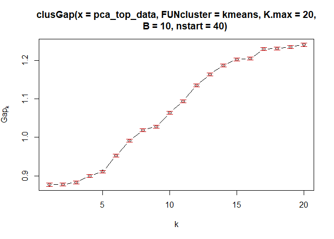
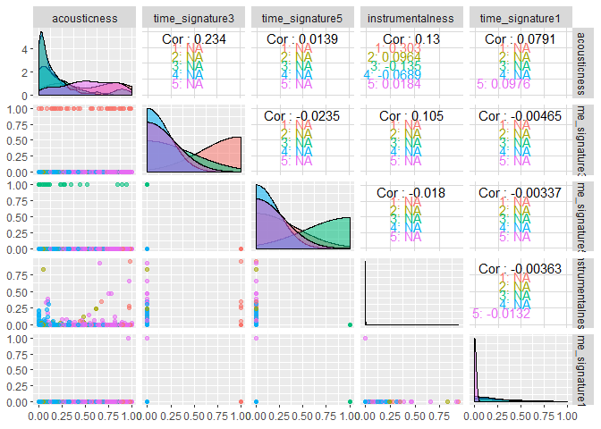

The Streams Analysis of Pop Music in 2018
=========================================

By Chong Wang, Tianping Wu, Zhenning Zhao, Zhiyang Lin

Introduction
------------

Popular music market is extremely large, especially in recent years. Pop songs inspire generations from all walks of life. Every day, oceans of pop tracks jump on to the Top 200 List of Spotify. In this project, we analysed the data of the 2018 popular music database from Spotify.com, in order to help the big digital music server improve playlist song recommendations and to help the record companies make decisions on which album to promote according to the predictions on the playing streams.

This project mainly answers the following questions: first, predict the streams of the tracks; and second, analysis the pattern of the popularity trend. To answer the first question, we used stepwise method, the lasso method and the random forest and boosting to build a prediction model of the streams of the tracks, with the features of the songs and the albums as predictor. In order to answer the second question, we first used PCA and K-means to cluster the songs by features, dividing songs into different categories. Then we plotted the trend of the popularity of different type of songs, showing the change in the trend of the listener’s taste.

Data
----

The dataset that we use comes from spotify.com. Spotify is one of the biggest digital music servicer that gives you access to many songs. From <https://spotifycharts.com>, we have the weekly data of the top 200 songs in the US. We use the data of 2018, giving us 1,497 different songs.

Fortunately, Spotify has a public API, which provides us many useful features of the songs. We use python robot to gather the data of not only the song features but also the data of the artists and the album. In the end, the formal dataset includes the following variables:

Table1: Variable Descriptions

<table style="width:56%;">
<colgroup>
<col width="23%" />
<col width="31%" />
</colgroup>
<thead>
<tr class="header">
<th>variables</th>
<th>descriptions</th>
</tr>
</thead>
<tbody>
<tr class="odd">
<td>id</td>
<td>song ID</td>
</tr>
<tr class="even">
<td>duration_ms_x</td>
<td>The duration of the track in milliseconds.</td>
</tr>
<tr class="odd">
<td>acousticness</td>
<td>A confidence measure from 0.0 to 1.0 of whether the track is acoustic. 1.0 represents high confidence the track is acoustic.</td>
</tr>
<tr class="even">
<td>danceability</td>
<td>Danceability describes how suitable a track is for dancing based on a combination of musical elements including tempo, rhythm stability, beat strength, and overall regularity. A value of 0.0 is least danceable and 1.0 is most danceable.</td>
</tr>
<tr class="odd">
<td>energy</td>
<td>Energy is a measure from 0.0 to 1.0 and represents a perceptual measure of intensity and activity. Typically, energetic tracks feel fast, loud, and noisy. For example, death metal has high energy, while a Bach prelude scores low on the scale. Perceptual features contributing to this attribute include dynamic range, perceived loudness, timbre, onset rate, and general entropy.</td>
</tr>
<tr class="even">
<td>instrumentalness</td>
<td>Predicts whether a track contains no vocals. “Ooh” and “aah” sounds are treated as instrumental in this context. Rap or spoken word tracks are clearly “vocal”. The closer the instrumentalness value is to 1.0, the greater likelihood the track contains no vocal content. Values above 0.5 are intended to represent instrumental tracks, but confidence is higher as the value approaches 1.0.</td>
</tr>
<tr class="odd">
<td>liveness</td>
<td>Detects the presence of an audience in the recording. Higher liveness values represent an increased probability that the track was performed live. A value above 0.8 provides strong likelihood that the track is live.</td>
</tr>
<tr class="even">
<td>loudness</td>
<td>The overall loudness of a track in decibels (dB). Loudness values are averaged across the entire track and are useful for comparing relative loudness of tracks. Loudness is the quality of a sound that is the primary psychological correlate of physical strength (amplitude). Values typical range between -60 and 0 db.</td>
</tr>
<tr class="odd">
<td>mode</td>
<td>Mode indicates the modality (major or minor) of a track, the type of scale from which its melodic content is derived. Major is represented by 1 and minor is 0.</td>
</tr>
<tr class="even">
<td>speechiness</td>
<td>Speechiness detects the presence of spoken words in a track. The more exclusively speech-like the recording (e.g. talk show, audio book, poetry), the closer to 1.0 the attribute value. Values above 0.66 describe tracks that are probably made entirely of spoken words. Values between 0.33 and 0.66 describe tracks that may contain both music and speech, either in sections or layered, including such cases as rap music. Values below 0.33 most likely represent music and other non-speech-like tracks.</td>
</tr>
<tr class="odd">
<td>tempo</td>
<td>The overall estimated tempo of a track in beats per minute (BPM). In musical terminology, tempo is the speed or pace of a given piece and derives directly from the average beat duration.</td>
</tr>
<tr class="even">
<td>valence</td>
<td>A measure from 0.0 to 1.0 describing the musical positiveness conveyed by a track. Tracks with high valence sound more positive (e.g. happy, cheerful, euphoric), while tracks with low valence sound more negative (e.g. sad, depressed, angry).</td>
</tr>
<tr class="odd">
<td>key</td>
<td>The estimated overall key of the track. Integers map to pitches using standard Pitch Class notation . E.g. 0 = C, 1 = C♯/D♭, 2 = D, and so on. If no key was detected, the value is -1.</td>
</tr>
<tr class="even">
<td>time_signature</td>
<td>An estimated overall time signature of a track. The time signature (meter) is a notational convention to specify how many beats are in each bar (or measure).</td>
</tr>
<tr class="odd">
<td>relseaseDuration</td>
<td>The date the album was first released.</td>
</tr>
</tbody>
</table>

The explanation of the variables comes from the following link: <https://developer.spotify.com/documentation/web-api/reference/tracks/get-audio-analysis/> Although this project only run on the dataset of 2018, we can do similar analysis for spotify for more songs and more recent data with similar method.

| ID   | Standard deviation  | Proportion of Variance | Cumulative Proportion |
|:-----|:--------------------|:-----------------------|:----------------------|
| PC1  | 2.80212353537273    | 0.112084941414909      | 0.1121                |
| PC2  | 1.77344288190906    | 0.0709377152763623     | 0.183                 |
| PC3  | 1.46727876624167    | 0.058691150649667      | 0.2417                |
| PC4  | 1.44279628131763    | 0.0577118512527051     | 0.2994                |
| PC5  | 1.2024934848242     | 0.0480997393929679     | 0.3475                |
| PC6  | 1.18118422033003    | 0.0472473688132011     | 0.3948                |
| PC7  | 1.16471426274806    | 0.0465885705099224     | 0.4414                |
| PC8  | 1.11901808461181    | 0.0447607233844724     | 0.4861                |
| PC9  | 1.10874235654547    | 0.0443496942618188     | 0.5305                |
| PC10 | 1.08797663277924    | 0.0435190653111695     | 0.574                 |
| PC11 | 1.08178043639889    | 0.0432712174559556     | 0.6173                |
| PC12 | 1.06412510961753    | 0.0425650043847012     | 0.6598                |
| PC13 | 1.05315275540945    | 0.0421261102163779     | 0.702                 |
| PC14 | 1.03932598862547    | 0.0415730395450188     | 0.7435                |
| PC15 | 1.00612785222318    | 0.0402451140889271     | 0.7838                |
| PC16 | 0.947189585246249   | 0.03788758340985       | 0.8217                |
| PC17 | 0.892958210859255   | 0.0357183284343702     | 0.8574                |
| PC18 | 0.821043647001771   | 0.0328417458800708     | 0.8902                |
| PC19 | 0.756342698063931   | 0.0302537079225572     | 0.9205                |
| PC20 | 0.647404260335455   | 0.0258961704134182     | 0.9464                |
| PC21 | 0.604914885182242   | 0.0241965954072897     | 0.9706                |
| PC22 | 0.419178980270296   | 0.0167671592108118     | 0.9873                |
| PC23 | 0.209254918185628   | 0.00837019672742513    | 0.9957                |
| PC24 | 0.100442731001129   | 0.00401770924004517    | 0.9997                |
| PC25 | 0.00698743489964209 | 0.000279497395985684   | 1                     |

