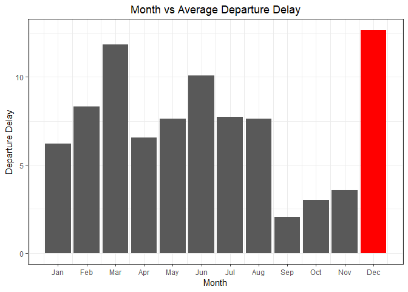
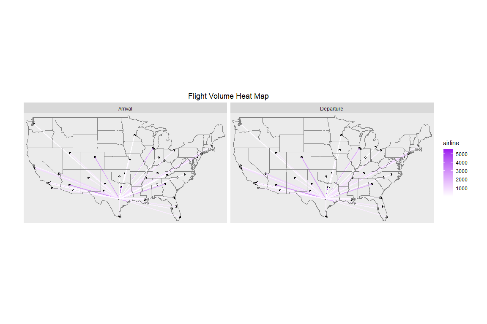
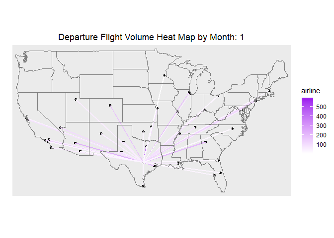
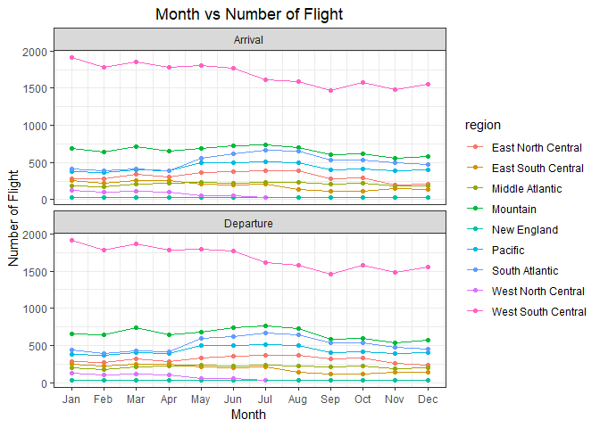
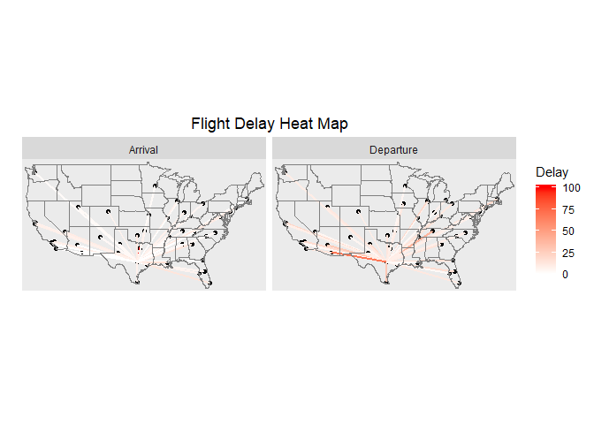

Exercise 1
==========

By Chong Wang, Tinaping Wu, Zhenning Zhao

Exercise 1.1
------------

The environmentally friendly buildings have some obvious advantages, not only from an eco-friendly view, but also from the financial aspect. The "data guru" did not make a reasonable argument to quantity the advantages clearly. To be more specific, we believe that the duration that he/she calculated to recover the cost may be mistaken.

The first step is to clean the data. The "data guru" noticed that a handful of the buildings in the data set had very low occupancy rates. Although this is a true fact, which can be shown in the graph above, he/she did not provide a satisfactory reason for why the buildings with less than 10% leasing rate should be removed from consideration. Due to this fact, we disagree to simply delete these 215 data points. Instead, we were able to identify a reason to delete buildings with 0% occupancy rate. According to a [research conducted by IBM](https://www.ibm.com/support/knowledgecenter/en/SSFCZ3_10.5.2/com.ibm.tri.doc/wpm_metrics/r_occupancy_rate.html), buildings with a 0% leasing rate is called “not-used buildings”. Since our new building will certainly be used, we can comfortably exclude these data points from the original data set.

After that, we tried to clean the data even furthur. Since this new project is in Austin with the tallest building at 56 floors, clusters with buildings higher than this value are clearly not in Austin and therefore should be removed from the data set. As the result, we are left with 6,618 data points.

According to the "data guru", there are still many outliers after data cleaning, so he/she chooses to use the median instead of the mean to calculate the expected rent to compare green and non-green buildings. We plot the boxplot of green and non-green buildings to get a overview of the data. It seems that the "data guru" was right about the outliers, but it is unclear why there are so many outliers. So we digged deeper, and got some interesting findings.

In order to narrow down existing data set further and only use data points that are relevant and comparable to our project, we looked for market standards to categorize buildings. According to \[the Commercial Real Estate Terms and Definitions\] (<https://www.naiop.org/-/media/Research/Research/Research-Reports/Terms-and-Definitions/CRE-Terms-and-Definitions-2017.ashx?la=en>) by The NAIOP Research Foundation, commercial buildings can be divided into 3 types: low rise, mid rise, and high rise. Our 15-story building falls into the mid-rise category. The plot above confirms that story is positively correlated with size in our data set and there are many mid rise buildings with similar attributes that can be used to estimate our building’s rent.

Next, we were curious if building’s age has any impact on rent. As shown in the plot above, rent shows no distinct trend as building’s age goes up, at least up to 100 years. This let us treat all buildings with different age equally for rent estimation.

    ## Scale for 'fill' is already present. Adding another scale for 'fill',
    ## which will replace the existing scale.

Lastly we added one more dimension to identify data points that are relevant to our building: Amenities. Our building is for mix use with amenities such as on-site bank, convenience store, dry cleaner, restaurant, retail shops, and fitness center. It is reasonable to assume these buildings would set rent differently than ones without amenities, as more value is added.

To our surprise, mid rise and high rise green buildings with amenities actually had higher rent than green buildings without amenities, as shown in the plot above. Putting this strange result aside, we will focus on the green and non-green buildings within the mid-rise group. It turns out that both types cost the same at $31 per square foot per year.

In final step, we aimed to explore the relationship between stories and occupancy rate, as well as age and occupancy rate in green and non-green buildings separately.

First, using all of occupancy rate data, we compared the difference of occupancy rate between green and non-green buildings, divided by low rise, medium rise and high rise category. By plotting bar charts above, we could clearly see the occupancy rate of green building building is higher than that of non-green building in each height category. Since our 15-story building falls into the mid-rise category, we can see that the occupancy rate of green building is 5% higher than that of non-green building in the long run. Thus, if we invest a 15-story green building instead of a non-green one, we can receive more occupancy rate.

Then we compared the difference of occupancy rate between green and non-green buildings in different ages. We selected the buildings that are below 30 years. The occupancy rate of green buildings are almost higher than that of non-green buildings in the first 30 years from the line chart. In the first 5 years, except age 3 and age 4, the occupancy rate of green buildings is significantly below 80%. Therefore, the average occupancy rate in the first ten years will be highly likely lower than 90%, which the most pessimistic estimation by the staff. With such a lower occupancy rate, we have a great opportunity to recuperate the costs over 9 years.

Exercise 1.2
------------

In this Question, we have the data of all the flight information of the airlines flying in and out of Austin.

### What is the best time of day to fly to minimize delays?

After clearing the data by deleting the cancelled flights and the diverted flights, we end up with a dataset of 97,659 pieces of data which will tell us the information about the delays.

First, we categorized the data by the scheduled departure time for the flights that depart Austin. And it gave us the above picture. According to the bar plot, the flights that depart Austin at midnight (at 12:00 AM) have the most departure delay. The average delay time for each flight is 23 minutes. It goes well with our intuition, since the ticket for the night flight is usually cheaper, the airline company don’t pay much attention to the schedule. The best time to depart Austin, on the other hand, is the morning. The flights at 6:00 AM actually departed earlier than the scheduled time.

Second, we categorized the data by the scheduled arrival time for the flights that arrive Austin. And it gave us the above picture. According to the bar plot, the flights that arrive Austin at 10:00 PM have the most arrival delay, and the average delay time for each flight is 18 minutes.The best time to arrive in Austin is the morning again. The flights at 7:00 AM arrived a little earlier than the scheduled time.

After checking the overall data, we seperated the data by airline companies, and gained the barplots for the departure delay and the arrival delay for each airline company, and the time window in which the flight has the most delay on average is labeled in red. Clearly the YV airlines has the most departure delay at 2:00 PM, which is obviously longer than any other companies’ flight.

From the view of arrival delay, the time for delay of OH, OO and UA are longer than other companies. The OH flights that arrive in Austin at 7:00PM have the most arrival delay. The OH flights that arrive in Austin at 7:00 PM have the most arrival delay. The OO flights that arrive in Austin at 9:00 PM have the most arrival delay. And the UA flights that arrive in Austin at 12:00 AM have the most arrival delay.

### What is the best time of year to fly to minimize delays?

Similar to the first part, we checked the best and worst time of the year to fly in or out of Austin. And we end up with the following two bar plots.

Clearly, December and March are the two worst months to fly out of Austin. Each flight delays about 13 minutes in December, and 12 minutes in March on average. The best time to departure Austin, on the other hand, is September and October.

When we look at the flight arriving in Austin, things didn’t change much. December and March are still the two worst months to fly into Austin. Each flight delays about 15 minutes in December, and 12 minutes in March on average. The best time to departure Austin is still September and October. Hence if you want to visit Austin, try to come in the fall, so that there will be no annoying flight delays!

### How do patterns of flights to different destinations or parts of the country change over the course of the year?

Overall, the top 5 airports with most flights to Austin in 2008 are Dallas Love Field, Dallas/Fort Worth International, George Bush Intercontinental, Phoenix Sky Harbor International and Denver International airport with 5,464, 5,344, 3,651, 2,778 and 2,708 flights respectively. The top 5 destinations from Austin are exactly the same 5 in the same order with 5,442, 5,347, 3,636, 2,765 and 2,653 flights respectively. This result is represented in the heat map above.

In terms of the patterns of flights to Austin over the course of the year, it is clear from the heat map above that flight volume increases at the beginning of the year and over the summer. This is partially due to with more airports with direct flights to Austin during this period. For example, Birmingham-Shuttlesworth International Airport and McGhee Tyson Airport only fly to Austin at the beginning of the year. And In the summer, Fort Lauderdale-Hollywood, Seattle-Tacoma International, and Indianapolis International are adding new services to Austin. Flights from Austin share the same pattern, with more flights at the beginning of year and in the summertime.

From the flight volume by region graph listed above, it can be seen that flights from West South Central contributed significantly to the high volume at the beginning of the year, and volume pops up in the summertime for Mountain, South Atlantic, Pacific, and East North Central regions. For detailed information about how the regions are divided, please visit: \[Census Bureau Regions and Divisions with State FIPS Codes\] (<https://www2.census.gov/geo/docs/maps-data/maps/reg_div.txt>)

### What are the bad airports to fly to?

Firstly, we considered the bad airports to fly to in terms of departure delay. We calculated average departure delay time for each airport and plot the bar chart to demonstrate average departure delay for different airports. From the graph, we can clearly see that Tucson international airport (TUS) had the longest departure delay time, which is almost 70 minutes. Nashville international airport (BNA), Harlingen Valley international airport (HRL), Phoenix Sky Harbor International Airport (PHX), Chicago O’Hare international airport (ORD) ranked 2nd, 3rd, 4th and 5th among the most departure delay airports, which departure delay time is approximately 38 minutes, 28 minutes, 21 minutes and 20 minutes. Therefore, if we want to fly from Austin to above five cities, especially Tucson, we need to get preparation for the departure delay, like watching movies to kill off boring waiting time.

Secondly, we got the bad airports to fly to in terms of arrival delay. We calculated average departure arrival time for each airport and plot the bar chart of average arrival delay of different airports. From the graph, We can clearly see that top five most arrival delay airports are Dallas/Fort Worth International Airport (DFW), Louis Armstrong New Orleans International Airport(MSY), Hartsfield-Jackson Atlanta International Airport (ATL), Fort Lauderdale-Hollywood International Airport (FLL) and El Paso International Airport (ELP). The airport at Dallas has the longest arrival delay time, which is almost 100 minutes. As a result, if we want to fly to above five cities from Austin, especially Dallas, we need to get preparation for the arrival delay. I suffered from terrible arrival delay at Dallas. Because of over 2-hour arrival delay, I missed transfer and stayed at airport overnight. Thus, for those people who want to make a transfer at Dallas, it’s better for them to leave enough time between two flights.

Finally, we drew Austin Flight Count Heat Map to show average arrival delay and departure delay of different airports around U.S.. On the map, the deeper the color of line is, the more delay time including departure and arrival delay of airport has. According to arrival delay, the worst airport to fly to from Austin is Dallas/Fort Worth International Airport, which is consistent with our conclusion before. Regarding to departure delay, Arizona state is the worst state to fly to, since both two biggest cities - Tucson and Phoenix have the longest delay time.

Exercise 1.3
------------

In this exercise, we used K-nearest neighbors(KNN) to build a predictive model for price, given mileage, separately for each of two trim levels: 350 and 65 AMG. First, we run the KNN models for the trim level of 350. Here is the plot for mileage vs price for the trim level of 350:

We splited the data into a training and a testing set. There are 80% of the data are in the training set. Then we run the K-nearest-neighbors, for many different values of K, starting at K=3 and going as high as the sample size. For each value of K, fit the model to the training set and make predictions on the test set, and calculate the out-of-sample root mean-squared error (RMSE) for each value of K. The plot of K versus RSME is showed below:

The optimal K for trim level 350 is printed below:

    ## [1] 50

Since the traning set is chosen randomly, if we run the KNN for several times, we will get different result. But generally, we can get the optimal K for trim level 350 is about 19. Then for the optimal value of K in this one running, a plot of the fitted modelis shown below:

Second, we run the KNN models for the trim level of 65 AMG similarly. Here is the plot for mileage vs price for the trim level of 65 AMG:

We splited the data into a training and a testing set. There are 80% of the data are in the training set. Then we run the K-nearest-neighbors, for many different values of K, starting at K=3 and going as high as the sample size. For each value of K, fit the model to the training set and make predictions on the test set, and calculate the out-of-sample root mean-squared error (RMSE) for each value of K. The plot of K versus RSME is showed below:

The optimal K for trim level 65 AMG is printed below:

    ## [1] 20

Since the traning set is chosen randomly, if we run the KNN for several times, we will get different result. But generally, we can get the optimal K for trim level 65 AMG is about 16. Then for the optimal value of K in this one running, a plot of the fitted modelis shown below:

In the end, it is showed that the average optimal K for trim level 350 is 19, which is larger than optimal K = 16 for trim level 65 AMG. We think that this is because that the sample size for the first data subset is larger than the second, and hence has a larger optimal K.
