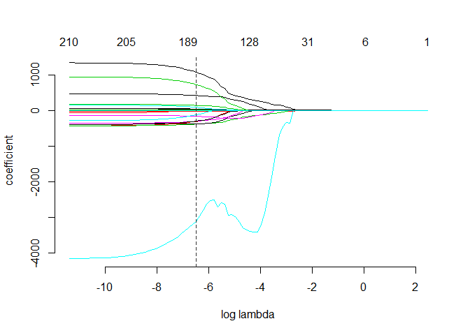
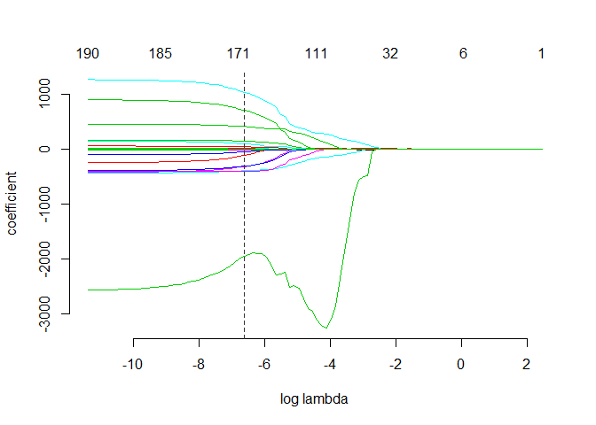

Exercise 3
==========

By Chong Wang, Tianping Wu, Zhenning Zhao

Exercise 3.1
------------

    ## Rent ~ cluster_rent + size + class_a + class_b + cd_total_07 + 
    ##     age + cluster + net + Electricity_Costs + hd_total07 + leasing_rate + 
    ##     LEED + amenities + cluster_rent:size + size:cluster + cluster_rent:cluster + 
    ##     class_b:age + class_a:age + cd_total_07:net + cd_total_07:hd_total07 + 
    ##     cluster_rent:age + size:leasing_rate + size:Electricity_Costs + 
    ##     size:class_a + age:Electricity_Costs + cluster_rent:leasing_rate + 
    ##     cluster_rent:net + cluster_rent:LEED + Electricity_Costs:hd_total07 + 
    ##     size:cd_total_07 + cluster:Electricity_Costs + class_a:cd_total_07 + 
    ##     cluster:hd_total07 + cluster_rent:hd_total07 + size:age + 
    ##     size:class_b + class_b:amenities + size:amenities + Electricity_Costs:amenities + 
    ##     cluster_rent:amenities + cluster:leasing_rate + age:cluster + 
    ##     size:hd_total07 + age:LEED

    ## Rent ~ cluster_rent + size + class_a + class_b + cd_total_07 + 
    ##     age + cluster + net + Electricity_Costs + hd_total07 + leasing_rate + 
    ##     green_rating + amenities + cluster_rent:size + size:cluster + 
    ##     cluster_rent:cluster + class_b:age + class_a:age + cd_total_07:net + 
    ##     cd_total_07:hd_total07 + cluster_rent:age + size:leasing_rate + 
    ##     size:Electricity_Costs + size:class_a + age:Electricity_Costs + 
    ##     cluster_rent:leasing_rate + cluster_rent:net + Electricity_Costs:hd_total07 + 
    ##     size:cd_total_07 + cluster:Electricity_Costs + cluster:hd_total07 + 
    ##     class_a:cd_total_07 + size:age + size:class_b + size:hd_total07 + 
    ##     cluster_rent:hd_total07 + green_rating:amenities + size:amenities + 
    ##     class_b:amenities + cluster_rent:amenities + Electricity_Costs:amenities + 
    ##     cluster:leasing_rate + age:cluster

    ## Rent ~ cluster + size + leasing_rate + stories + age + renovated + 
    ##     class_a + class_b + LEED + Energystar + net + amenities + 
    ##     hd_total07 + total_dd_07 + Precipitation + Electricity_Costs + 
    ##     cluster_rent + cluster:size + cluster:empl_gr + cluster:leasing_rate + 
    ##     cluster:stories + cluster:age + cluster:renovated + cluster:class_a + 
    ##     cluster:class_b + cluster:LEED + cluster:Energystar + cluster:net + 
    ##     cluster:hd_total07 + cluster:total_dd_07 + cluster:Precipitation + 
    ##     cluster:Gas_Costs + cluster:Electricity_Costs + cluster:cluster_rent + 
    ##     size:empl_gr + size:leasing_rate + size:stories + size:age + 
    ##     size:renovated + size:class_a + size:class_b + size:LEED + 
    ##     size:Energystar + size:net + size:amenities + size:cd_total_07 + 
    ##     size:hd_total07 + size:Precipitation + size:Gas_Costs + size:Electricity_Costs + 
    ##     size:cluster_rent + empl_gr:leasing_rate + empl_gr:stories + 
    ##     empl_gr:age + empl_gr:renovated + empl_gr:class_b + empl_gr:LEED + 
    ##     empl_gr:net + empl_gr:amenities + empl_gr:hd_total07 + empl_gr:Precipitation + 
    ##     empl_gr:Electricity_Costs + empl_gr:cluster_rent + leasing_rate:stories + 
    ##     leasing_rate:age + leasing_rate:class_a + leasing_rate:class_b + 
    ##     leasing_rate:LEED + leasing_rate:net + leasing_rate:amenities + 
    ##     leasing_rate:cd_total_07 + leasing_rate:hd_total07 + leasing_rate:total_dd_07 + 
    ##     leasing_rate:Precipitation + leasing_rate:Gas_Costs + leasing_rate:Electricity_Costs + 
    ##     leasing_rate:cluster_rent + stories:age + stories:renovated + 
    ##     stories:class_a + stories:class_b + stories:LEED + stories:Energystar + 
    ##     stories:net + stories:amenities + stories:cd_total_07 + stories:hd_total07 + 
    ##     stories:Precipitation + stories:Gas_Costs + stories:Electricity_Costs + 
    ##     stories:cluster_rent + age:renovated + age:class_a + age:class_b + 
    ##     age:LEED + age:Energystar + age:net + age:amenities + age:cd_total_07 + 
    ##     age:hd_total07 + age:total_dd_07 + age:Precipitation + age:Gas_Costs + 
    ##     age:Electricity_Costs + age:cluster_rent + renovated:class_a + 
    ##     renovated:class_b + renovated:LEED + renovated:Energystar + 
    ##     renovated:net + renovated:amenities + renovated:cd_total_07 + 
    ##     renovated:hd_total07 + renovated:total_dd_07 + renovated:Precipitation + 
    ##     renovated:Gas_Costs + renovated:Electricity_Costs + renovated:cluster_rent + 
    ##     class_a:LEED + class_a:Energystar + class_a:net + class_a:amenities + 
    ##     class_a:cd_total_07 + class_a:hd_total07 + class_a:total_dd_07 + 
    ##     class_a:Precipitation + class_a:Gas_Costs + class_a:Electricity_Costs + 
    ##     class_a:cluster_rent + class_b:LEED + class_b:Energystar + 
    ##     class_b:net + class_b:amenities + class_b:cd_total_07 + class_b:hd_total07 + 
    ##     class_b:total_dd_07 + class_b:Precipitation + class_b:Gas_Costs + 
    ##     class_b:Electricity_Costs + class_b:cluster_rent + LEED:Energystar + 
    ##     LEED:net + LEED:amenities + LEED:cd_total_07 + LEED:total_dd_07 + 
    ##     LEED:Precipitation + LEED:Gas_Costs + LEED:Electricity_Costs + 
    ##     LEED:cluster_rent + Energystar:net + Energystar:amenities + 
    ##     Energystar:cd_total_07 + Energystar:total_dd_07 + Energystar:Precipitation + 
    ##     Energystar:Electricity_Costs + Energystar:cluster_rent + 
    ##     net:amenities + net:cd_total_07 + net:total_dd_07 + net:Precipitation + 
    ##     net:Gas_Costs + net:Electricity_Costs + net:cluster_rent + 
    ##     amenities:hd_total07 + amenities:total_dd_07 + amenities:Precipitation + 
    ##     amenities:Gas_Costs + amenities:Electricity_Costs + amenities:cluster_rent + 
    ##     cd_total_07:hd_total07 + cd_total_07:total_dd_07 + cd_total_07:Precipitation + 
    ##     cd_total_07:Electricity_Costs + cd_total_07:cluster_rent + 
    ##     hd_total07:total_dd_07 + hd_total07:Precipitation + hd_total07:cluster_rent + 
    ##     Precipitation:Gas_Costs + Precipitation:Electricity_Costs + 
    ##     Precipitation:cluster_rent + Gas_Costs:Electricity_Costs + 
    ##     Gas_Costs:cluster_rent + Electricity_Costs:cluster_rent

    ## Rent ~ cluster + size + leasing_rate + stories + age + renovated + 
    ##     class_a + class_b + green_rating + net + amenities + hd_total07 + 
    ##     total_dd_07 + Precipitation + Electricity_Costs + cluster_rent + 
    ##     cluster:size + cluster:empl_gr + cluster:leasing_rate + cluster:stories + 
    ##     cluster:age + cluster:renovated + cluster:class_a + cluster:class_b + 
    ##     cluster:green_rating + cluster:net + cluster:amenities + 
    ##     cluster:hd_total07 + cluster:total_dd_07 + cluster:Precipitation + 
    ##     cluster:Gas_Costs + cluster:Electricity_Costs + cluster:cluster_rent + 
    ##     size:empl_gr + size:leasing_rate + size:stories + size:age + 
    ##     size:renovated + size:class_a + size:class_b + size:green_rating + 
    ##     size:amenities + size:cd_total_07 + size:hd_total07 + size:Precipitation + 
    ##     size:Gas_Costs + size:Electricity_Costs + size:cluster_rent + 
    ##     empl_gr:leasing_rate + empl_gr:stories + empl_gr:age + empl_gr:renovated + 
    ##     empl_gr:class_b + empl_gr:green_rating + empl_gr:amenities + 
    ##     empl_gr:hd_total07 + empl_gr:Precipitation + empl_gr:Electricity_Costs + 
    ##     empl_gr:cluster_rent + leasing_rate:stories + leasing_rate:age + 
    ##     leasing_rate:class_a + leasing_rate:class_b + leasing_rate:green_rating + 
    ##     leasing_rate:net + leasing_rate:amenities + leasing_rate:cd_total_07 + 
    ##     leasing_rate:hd_total07 + leasing_rate:total_dd_07 + leasing_rate:Precipitation + 
    ##     leasing_rate:Gas_Costs + leasing_rate:Electricity_Costs + 
    ##     leasing_rate:cluster_rent + stories:age + stories:renovated + 
    ##     stories:class_a + stories:class_b + stories:green_rating + 
    ##     stories:net + stories:amenities + stories:cd_total_07 + stories:hd_total07 + 
    ##     stories:Precipitation + stories:Gas_Costs + stories:Electricity_Costs + 
    ##     stories:cluster_rent + age:renovated + age:class_a + age:class_b + 
    ##     age:green_rating + age:net + age:amenities + age:cd_total_07 + 
    ##     age:hd_total07 + age:total_dd_07 + age:Precipitation + age:Gas_Costs + 
    ##     age:Electricity_Costs + age:cluster_rent + renovated:class_a + 
    ##     renovated:class_b + renovated:green_rating + renovated:net + 
    ##     renovated:amenities + renovated:cd_total_07 + renovated:hd_total07 + 
    ##     renovated:total_dd_07 + renovated:Precipitation + renovated:Gas_Costs + 
    ##     renovated:Electricity_Costs + renovated:cluster_rent + class_a:green_rating + 
    ##     class_a:net + class_a:amenities + class_a:cd_total_07 + class_a:hd_total07 + 
    ##     class_a:total_dd_07 + class_a:Precipitation + class_a:Gas_Costs + 
    ##     class_a:Electricity_Costs + class_a:cluster_rent + class_b:green_rating + 
    ##     class_b:net + class_b:amenities + class_b:cd_total_07 + class_b:hd_total07 + 
    ##     class_b:total_dd_07 + class_b:Precipitation + class_b:Gas_Costs + 
    ##     class_b:Electricity_Costs + class_b:cluster_rent + green_rating:net + 
    ##     green_rating:amenities + green_rating:cd_total_07 + green_rating:hd_total07 + 
    ##     green_rating:Precipitation + green_rating:Gas_Costs + green_rating:Electricity_Costs + 
    ##     green_rating:cluster_rent + net:amenities + net:cd_total_07 + 
    ##     net:total_dd_07 + net:Precipitation + net:Gas_Costs + net:Electricity_Costs + 
    ##     net:cluster_rent + amenities:hd_total07 + amenities:total_dd_07 + 
    ##     amenities:Precipitation + amenities:Gas_Costs + amenities:Electricity_Costs + 
    ##     amenities:cluster_rent + cd_total_07:hd_total07 + cd_total_07:total_dd_07 + 
    ##     cd_total_07:Precipitation + cd_total_07:Electricity_Costs + 
    ##     cd_total_07:cluster_rent + hd_total07:total_dd_07 + hd_total07:Precipitation + 
    ##     hd_total07:cluster_rent + total_dd_07:Electricity_Costs + 
    ##     Precipitation:Gas_Costs + Precipitation:Electricity_Costs + 
    ##     Precipitation:cluster_rent + Gas_Costs:Electricity_Costs + 
    ##     Gas_Costs:cluster_rent + Electricity_Costs:cluster_rent

    ## [1] 9.199302 9.194623 9.299225 9.216758

    ##                  (Intercept)                 cluster_rent 
    ##                 7.545433e+00                 8.507614e-01 
    ##                         size                      class_a 
    ##                -1.575534e-02                 5.808478e+00 
    ##                      class_b                  cd_total_07 
    ##                 4.618605e+00                 1.218062e-05 
    ##                          age                      cluster 
    ##                 2.692105e-02                -6.788977e-03 
    ##                          net            Electricity_Costs 
    ##                -5.764383e-01                -2.878859e+02 
    ##                   hd_total07                 leasing_rate 
    ##                -6.525369e-04                -2.948967e-02 
    ##                 green_rating                    amenities 
    ##                 2.294792e+00                -1.688043e+00 
    ##            cluster_rent:size                 size:cluster 
    ##                 4.042199e-04                 5.579955e-06 
    ##         cluster_rent:cluster                  class_b:age 
    ##                 7.528733e-05                -4.530344e-02 
    ##                  class_a:age              cd_total_07:net 
    ##                -2.948802e-02                 9.684441e-04 
    ##       cd_total_07:hd_total07             cluster_rent:age 
    ##                -2.845268e-07                -1.803267e-03 
    ##            size:leasing_rate       size:Electricity_Costs 
    ##                 1.078452e-04                 2.958192e-01 
    ##                 size:class_a        age:Electricity_Costs 
    ##                -1.275192e-02                 1.654240e+00 
    ##    cluster_rent:leasing_rate             cluster_rent:net 
    ##                 1.655459e-03                -1.159047e-01 
    ## Electricity_Costs:hd_total07             size:cd_total_07 
    ##                 4.472173e-02                -1.317423e-06 
    ##    cluster:Electricity_Costs           cluster:hd_total07 
    ##                 1.703656e-01                 5.215901e-07 
    ##          class_a:cd_total_07                     size:age 
    ##                 5.790688e-04                -5.863860e-05 
    ##                 size:class_b              size:hd_total07 
    ##                -8.955488e-03                 4.983504e-07 
    ##      cluster_rent:hd_total07       green_rating:amenities 
    ##                -1.848286e-05                -2.150574e+00 
    ##               size:amenities            class_b:amenities 
    ##                 3.054381e-03                 1.132012e+00 
    ##       cluster_rent:amenities  Electricity_Costs:amenities 
    ##                -6.554303e-02                 9.710612e+01 
    ##         cluster:leasing_rate                  age:cluster 
    ##                -2.555993e-05                -1.400855e-05

Exercise 3.2
------------

### Why can’t I just get data from a few different cities and run the regression of “Crime” on “Police” to understand how more cops in the streets affect crime?

We cannot just do the simple regression of “Crime” on “Police” because although Crime rate depends on police force, the demand of police force might also depend on the crime rate. One could assume that when a city put more police on the street the crime rate tends to drop, and more police is needed if the crime rate of a city is high. So it’s actually 2 equations other than one to be regressed. However, the data that we have on hand mixed these two effects so that we cannot tell what is the cause for the changes in the crime rate. So we cannot simply do the regression of “Crime” on “Police”.

### How were the researchers from UPenn able to isolate this effect? Briefly describe their approach and discuss their result in the “Table 2” below, from the researcher's paper.

The researchers from UPenn took the endogeneity problem into consideration and included an instrument variable that is days with a high alert and a control variable that is ridership in order to isolate this effect. They first collected DC’s crime data as well as data of days when there was a high alert for potential terrorist attacks.

Because in the days when there’s a high alert for potential terrorist attacks, the mayor of DC will respond to that actively by sending more cops in the street, that decision made by mayor has no intention to reduce the crime in the street. In the days when there’s a high alert, people may not go out, thus the chances of the crime will decrease which induce less crimes that was not caused by more cops in those days. The researchers then chose ridership as a control variable. If the number of ridership is as usual, that means the number of people do not decrease due to the high alert; If the number of ridership is less as usual, that means the number of people decrease due to the high alert. Thus, researchers need to control the ridership. From table 1, we saw that days with a high alert have lower crimes, since the coefficient is -6.046, which is also significant at 5% level after including the control variable ridership.

Thus, holding the number of people go out in the days when there’s a high alert fixed (holding the ridership fixed), the crime becomes lower in those days is due to more cops in the street.

### Why did they have to control for Metro ridership? What was that trying to capture?

Although the technology mentioned above is very genius, someone might argue that it might not be true that the correlation between the alert and the crime rate is zero. During the high alert days people might be too scared to go out, so there might be less chances for crime opportunities, leading to a lower crime rate.

Hence, the researcher controlled for Metro ridership (as a way of measuring population outdoor activeness) and rerun the regression again. If the result of regressing crime rate on police force controlling the ridership is still negative, then it’s more convincible to say that the regression captures the influence of police force on crime rate.

From the second regression of table 2, it is shown that holding the ridership fixed, the parameter in front of the police force is still negative. This result in some degree rules out the possibility that mentioned above. However, we can’t for sure prove that more cops leads to less crime. The street criminals might be too afraid of terrorists and decide not to go out and during a high alert day. This would lead to a reduction in crime that is not related to more police in the streets.

### Below I am showing you "Table 4" from the researchers' paper. Just focus on the first column of the table. Can you describe the model being estimated here? What is the conclusion?

Table 4 demonstrates on effect of high alert on crime across different districts in DC. By having models with interaction terms between districts and alert days, it can be shown that only the effect in district 1 is significant. High alert days with more cops bring the daily total number of crimes down in district 1. This makes sense because D.C. would most likely deploy high ratio of the extra cops in this district for security reasons as terrorists targets like US Capitol,the White House, Federal Triangle and US Supreme Court are all there. The effects in the other districts are insignificant as the confidence interval lies on the coefficient of zero.
