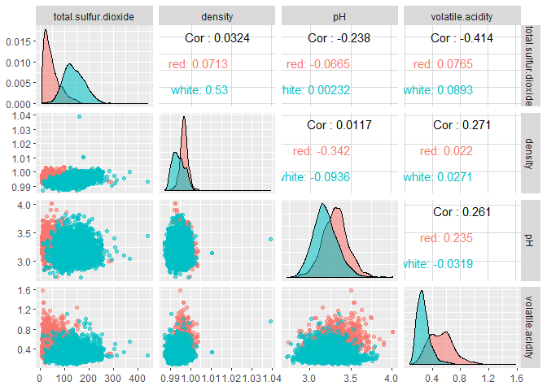
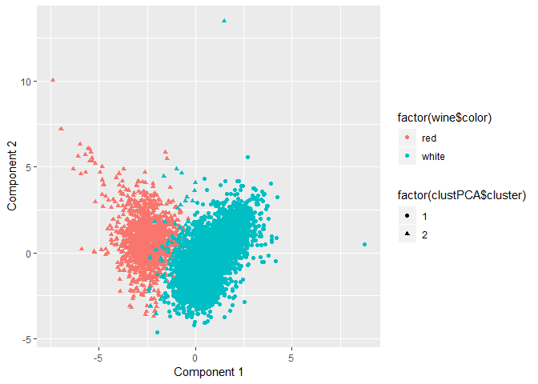
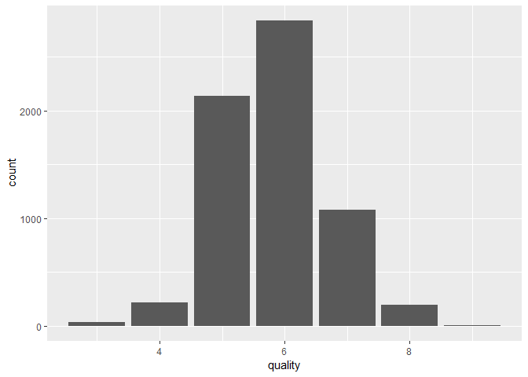
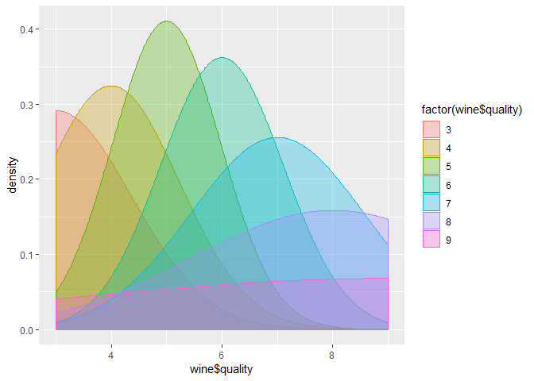
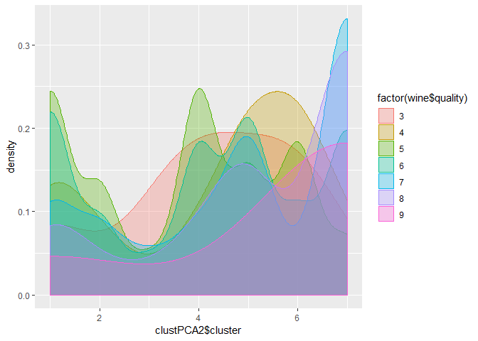
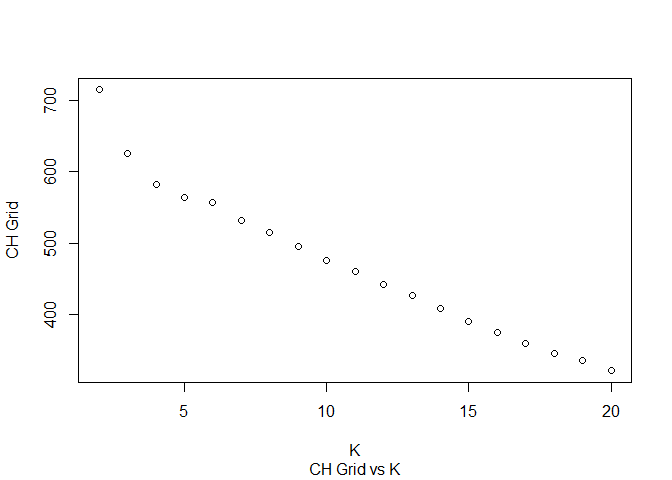
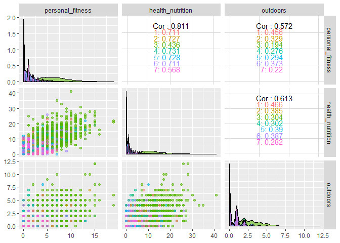
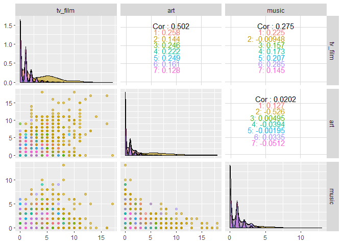
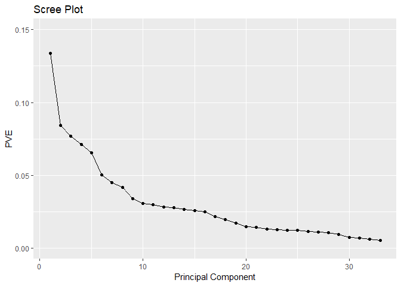
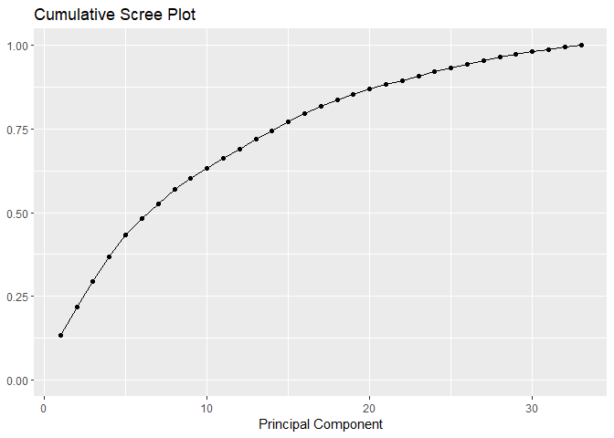

Exercise 4
==========

By Chong Wang, Tianping Wu, Zhenning Zhao

Exercise 4.1 Clustering and PCA
-------------------------------

### Distinguishing the color of the wine

First we normalize the data. After demeaning and scaling with their standard deviation, we end up with a 6,497\*11 dataset. The following is the heatmap of the correlation between these 11 chemical properties.

Although there are 11 chemical properties, we choose to visualize the data through only 4 dimensions: total sulfur dioxide, density, pH, and volatile acidity. The following graph shows the distribution of the red wines and the white wine on these 4 dimensions. We randomly pick these 4 properties to give a first taste of the data. From the graph we can tell that the red wine and the white wine have different features, so it is highly possible for us to distinguish these two different type of wines.

Since we have already have a basic impression of 2 categories in mind, we choose to do clustering with K=2.

First, by using K-means, we can divide the wines into 2 category. Visualizing through the total sulfur dioxide and the density, we can tell that K=means did an excellent work distinguishing red wines and white wines.

More specifically, we can calculate the accuracy rate by looking at the following confusion matrix. The accuracy rate for K-means is (4,830+1,575)/6,497 = 98.6%, which is pretty high. This means by looking at the chemical properties, the K-means can characterize the red wine and white wine almost perfectly.

    ##               wine$color
    ## clust1$cluster  red white
    ##              1 1575    68
    ##              2   24  4830

Second, we use the PCA method. The summary of the scores is listed below. The first four principal components capture about 73% of the variance in the data. So I choose to use the first four principal components to do the clustering. The following is the graph of different wines and different categories on the scale of the first two components. As the graph shows, the PCA is also a good way to differ red wines from white wines.

    ## Importance of components:
    ##                           PC1    PC2    PC3     PC4     PC5     PC6
    ## Standard deviation     1.7407 1.5792 1.2475 0.98517 0.84845 0.77930
    ## Proportion of Variance 0.2754 0.2267 0.1415 0.08823 0.06544 0.05521
    ## Cumulative Proportion  0.2754 0.5021 0.6436 0.73187 0.79732 0.85253
    ##                            PC7     PC8     PC9   PC10    PC11
    ## Standard deviation     0.72330 0.70817 0.58054 0.4772 0.18119
    ## Proportion of Variance 0.04756 0.04559 0.03064 0.0207 0.00298
    ## Cumulative Proportion  0.90009 0.94568 0.97632 0.9970 1.00000

More specifically, we can calculate the accuracy rate by looking at the following confusion matrix. The accuracy rate for K-PCA is (4,818+1,575)/6,497 = 98.4%, which is slightly lower than the K-mean result. In conclusion, to differ white wines and red wines, we can simply use the K-mean method and it will give us a pretty good result.

    ##                 wine$color
    ## clustPCA$cluster  red white
    ##                1 1575    80
    ##                2   24  4818

### Distinguishing the quality of the wine

Before we do the clustering, the following barplot shows the distribution of the different qualities. There are only 7 different qualities of wines in the dataset. It seems that most of the wines have quality of 5 or 6, and only a few of them have very high or very low quality. Since normally the clustering method would divide the data into different categories quite equally, it might be very hard for K-means algorithm to successfully identify the quality of the wines.

What’s more, by data visualization, it seems that the wines with different qualities have similar chemistry features, making it even more difficult to identify the quality of the wine.

First, by using K-means, we can divide the wines into 7 category. The perfect density graph should be as follow.

However, the density of different wine should be concentrating on different categories. The result, as is shown in the following density graph and the confusion matrix, is not so good. There is no obvious pattern that could be pointed out from the clustering. Hence the K-mean method fails at this challenge, just as we expected.

    ##               wine$quality
    ## clust2$cluster   3   4   5   6   7   8   9
    ##              1   4  17  75 517 452  96   4
    ##              2   2  28 302 511 175  29   0
    ##              3   3   2  52  43   2   0   0
    ##              4   5  66 403 518 145  30   0
    ##              5   3  15 193 261 140  14   0
    ##              6   6  64 475 343  43   2   0
    ##              7   7  24 638 643 122  22   1

Second, we use the PCA method. Still we choose to use the first four principal components to do the clustering with K=7. The following is the graph of different wines qualities and different categories on the scale of the first two components. From the graph we can hardly tell any relations between the quality of the wine and the categories that we find.

The similar story can be told by looking at the confusion matrix and the density graph. However, the PCA method is slightly better than the K-means, since the high quality wine tends to cluster into similar categories. Saying that, the overall result of the prediction is still a nightmare. The chemistry feature just might not be the reason for the different qualities of the wine.

    ##                  wine$quality
    ## clustPCA2$cluster   3   4   5   6   7   8   9
    ##                 1   7  57 364 275  37   2   0
    ##                 2   2  17 113 532 449  94   4
    ##                 3   5  55 310 532 197  42   0
    ##                 4   5  40 444 591 143  23   0
    ##                 5   0  19 267 247  97   8   0
    ##                 6   7  23 550 538 101  18   1
    ##                 7   4   5  90 121  55   6   0

In conclusion, we might not be able to tell the difference among the different quality wine by only looking at the chemical features of the wine.

Exercise 4.2 Market segmentation
--------------------------------

### 4.2.1 Data pre-process

First we decided to eliminate as many bots as possible from the slip through. All users with spam posts are assumed to be pots as only a few dozens of them had spam posts. Users with pornography posts are a bit complicated because more than a few couple hundred users had them and at the same time also posted significant amount of other types of posts, so they might just be actual human users with interests in pornography to some extent . To distinguish between humans and bots, we set an arbitrary rule of 20/80 to delete all users having more than 20% of their total posts in pornagraphy. Next, column chatter and uncategorized are deleted because they are the labels that do not fit at all into any of the interest categories. At the end, we are left with 7,676 users to determine market segmentation using clustering and principal components analysis methodologies. At last, there are 33 variables left.

### 4.2.2 Clustering

In order to determine market segment by k-means clustering, we must first select the number of initial centroids, or in other words, the number of user types. 3 types of supporting analysis were used to help us determine the quantity: Elbow plot(SSE), CH index and Gap statistics.

As shown above, the results are subtle and therefore difficult to determine the best number for K. We eventually picked K=7 for two reasons, 1. we observed a weak signal of dipping in the Gap statistic graph and 2. we found about the equal number of interest groups with relatively strong correlated interests from our correlation analysis as shown below.

We created this heat map hoping to have a deeper analysis of each cluster. Even though we would never know the full picture of each cluster, we believed interests with high proximity, or high correlation, would most likely be fit into same cluster. The more common interests we find from each cluster, the better we can describe each market segment and therefore are able to help our client creating cluster based market strategies.

Some distinct market segments with highly correlated interests are listed below based on the heat map

-   Personal fitness, outdoors, health & nutrition

-   Fashion, cooking, beauty, shopping, photo sharing

-   Online gaming, college&university, sports playing

-   Sports fandom, food, family, religion, parenting, school

-   Politics, news, computers, travel, automobiles

-   TV film, art, music

-   Everything, shopping, photo sharing - From the graphs above, we can see the last group being a very special one, showing moderate interests in almost all areas (compared to strong distinct tastes in other groups). Within the group, interests toward shopping and photo sharing seems to stand out.

### 4.2.3 Principal Components Analysis

After data pre-process, In order to reduce dimension of 33 different categories variables, we decided to use principal components analysis methods to find principal components, which can explain most of the variability in the data.

After center and scale the data, we did the correlation analysis of total 33 categories first. In the correlation matrix above, we found that the correlation of those categories are relatively weak, as most correlation coefficients are below 0.3. Thus, we suppose that the proportion of variance explained by most dominant principal components will not be as high as we expected.

We first got the loadings matrix and scores matrix from principal components methods. Then we calculated proportion of variance explained (PVE) to decide the number of principal components that we need to choose.

    ##  [1] 0.13 0.08 0.08 0.07 0.07 0.05 0.04 0.04 0.03 0.03 0.03 0.03 0.03 0.03
    ## [15] 0.03 0.02 0.02 0.02 0.02 0.01 0.01 0.01 0.01 0.01 0.01 0.01 0.01 0.01
    ## [29] 0.01 0.01 0.01 0.01 0.01

In the above table, we can see that the first eight principal components can explain most of the variability. The first principal component explains 13% of the variability; the second principal component explains 8% of the variability; the third principal component explains 8% of the variability;the fourth principal component explains 7% of the variability; the fifth principal component explains 7% of the variability; the sixth principal component explains 5% of the variability; the seventh principal component explains 4% of the variability; the eighth principal component explains 4% of the variability. Together, the first eight principal components explain 56% of the variability.

In the PVE Plot, we can see that between eighth and ninth components, there’s a significant gap in the Scree Plot. Also, from the Cumulative PVE Plot, we can find that first eight principal components can explain more than 50% of the total variability. Thus, we choose 8 principal components to divide the market of NutrientH20 into 8 segments. The characteristics of these 8 market segments are actually latent factor inferred from 33 interests categories.

Then we got top 5 interests of followers of NutrientH20 in each market segment.

    ## [1] "religion"      "food"          "parenting"     "sports_fandom"
    ## [5] "school"

    ## [1] "sports_fandom" "religion"      "parenting"     "food"         
    ## [5] "school"

    ## [1] "politics"   "travel"     "computers"  "news"       "automotive"

    ## [1] "health_nutrition" "personal_fitness" "outdoors"        
    ## [4] "politics"         "news"

    ## [1] "beauty"        "fashion"       "cooking"       "photo_sharing"
    ## [5] "shopping"

    ## [1] "online_gaming"  "sports_playing" "college_uni"    "cooking"       
    ## [5] "automotive"

    ## [1] "automotive"     "shopping"       "photo_sharing"  "news"          
    ## [5] "current_events"

    ## [1] "news"       "automotive" "tv_film"    "art"        "beauty"

In the 1st market segment, top 5 interest of followers are "religion", "food", "parenting", "sports\_fandom" and "school".

In the 2nd market segment, top 5 interest of followers are "sports\_fandom", "religion", "parenting", "food" and "school".

In the 1st and 2nd market segment, the top 5 interests are same, so we combine them into one segment as new 1st market segment.

In the 2nd market segment, top 5 interest of followers are "politics", "travel", "computers", "news" and "automotive".

In the 3rd market segment, top 5 interest of followers are "health\_nutrition", "personal\_fitness", "outdoors", "politics" and "news".

In the 4th market segment, top 5 interest of followers are "beauty", "fashion", "cooking", "photo\_sharing" and "shopping".

In the 5th market segment, top 5 interest of followers are "online\_gaming", "sports\_playing", "college\_uni", "cooking" and "automotive".

In the 6th market segment, top 5 interest of followers are "automotive", "shopping", "photo\_sharing", "news" and "current\_events".

In the 7th market segment, top 5 interest of followers are "news", "automotive", "tv\_film", "art" and "beauty".

Finally, we extracted 7 market segments.

### 4.2.4 Conclusion

From the clustering and principal component analysis, we extracted 7 analysis from both of them. The first market segment found by clustering is similar with the third segment found by PCA as they have same interests - Personal fitness, outdoors and health & nutrition.

The second market segment found by clustering is similar with the fourth segment found by PCA as they have same interests - Fashion, cooking, beauty, shopping and photo sharing.

The third market segment found by clustering is similar with the fifth segment found by PCA as they have same interests - Online gaming, college&university and sports playing.

The fourth market segment found by clustering is similar with the first segment found by PCA as they have same interests - Sports fandom, food, religion, parenting and school.

The fifth market segment found by clustering is similar with the second segment found by PCA as they have same interests - Politics, news, computers, travel and automobiles.

The sixth market segment found by clustering is similar with the seventh segment found by PCA as they have similar interests - TV film and art.

The seventh market segment found by clustering is similar with the sixth segment found by PCA as they have similar interests - shopping and photo sharing.

Finally, we labeled above seven market segments to show their unique characteristics.

We named the first market segment as “Mr. fitness”. Those kinds of people focus on working out and keeping in a good shape.

We named the second market segment as “Mrs. fashion”. Those kinds of people like keeping up with fashion and sharing their happy moments with friends.

We named the third market segment as “typical college student”. College students consist with most parts of this group. They are fond of entertainment such as online games and sports during their rest time.

We named the fourth market segment as “middle-age parents”. They care about the fostering of their children. Also, they have interests in sports games.

We named the fifth market segment as “business man”. They pay attention to daily news online. Also, they like travelling during vacation.

We named the sixth market segment as “Hippie”. They like visiting gallery and enjoying movies.

We named the seventh market segment as “Typical online user with interests toward everything but mainly shopping and photo sharing”. This is the typical you and me.

Exercise 4.3 Association rules for grocery purchases
----------------------------------------------------
